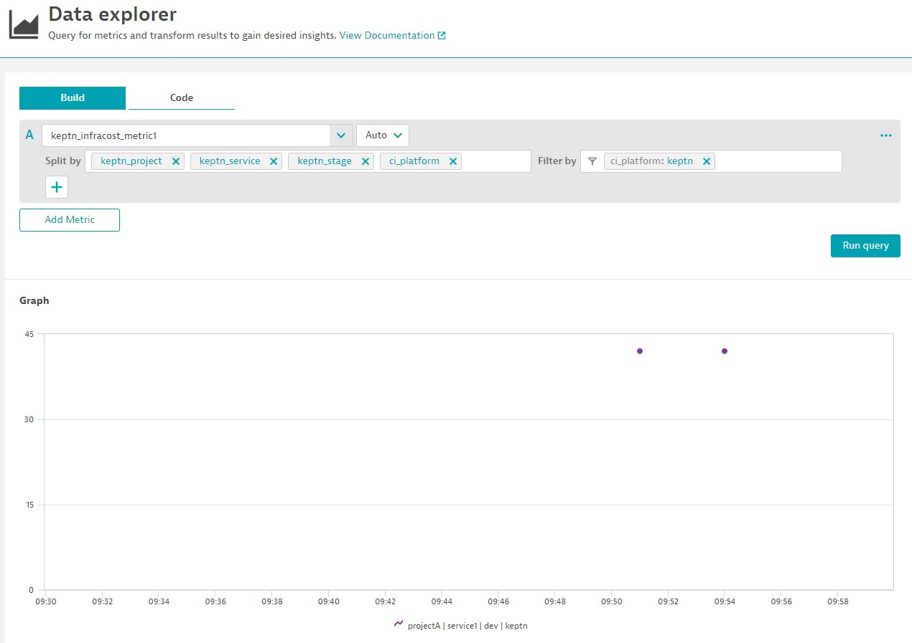

## Output Metrics to Dynatrace



Dynatrace offers an API endpoint so you can push metrics into Dynatrace by following the [line format](https://www.dynatrace.com/support/help/extend-dynatrace/extend-metrics/reference/metric-ingestion-protocol):

```
metric.key,dimensions payload
eg.
my.value,ci_platform="keptn",keptn_project="projectA",keptn_service="service1",keptn_stage="dev" 42
```

### Gather Details and Create Secret

The job executor service requires details of your Dynatrace environment.

In the same namespace as the job executor service, create a secret to hold the `DT_TENANT` and `DT_API_TOKEN` values.

`DT_TENANT` should take the format (no trailing slashes):

- Dynatrace SaaS: `https://{your-environment-id}.live.dynatrace.com`
- Dynatrace Managed: `https://{your-domain}/e/{your-environment-id}`

`DT_API_TOKEN` requires the following permissions:

- `metrics.ingest` (Scope API: v2)

Example:
```
DT_TENANT=https://abc12345.live.dynatrace.com
DT_API_TOKEN=dtc01.******.*****
JES_NAMESPACE=NamespaceWhereJobExecutorServiceIsInstalled
kubectl create secret generic dt_details \
--namespace $JES_NAMESPACE \
--from-literal=DT_TENANT=$DT_TENANT \
--from-literal=DT_API_TOKEN
```

### Create job/config.yaml

Reference the above secret in the `job/config.yaml`. By doing so, `DT_TENANT` and `DT_API_TOKEN` become available as environment variables.

For `image`, use any image with Python and the `requests` module installed. You can use [gardnera/requests:v0.0.1](https://hub.docker.com/r/gardnera/requests) (rarely updated) or build one yourself (recommended) like this:

```
FROM python:slim
RUN pip install requests
```

```
apiVersion: v2
actions:
  - name: "Run Your Tool"
    events:
      - name: "sh.keptn.event.YourEvent.triggered"
    tasks:
      - name: "Execute tool"
        env:
          - name: dt_details
            valueFrom: secret
        files:
          - /files/app.py
        image: "gardnera/requests:v0.0.1"
        cmd: 
          - "python"
        args:
          - "/keptn/files/app.py"
```

If you need help with the job executor file syntax, [go here](https://github.com/keptn-contrib/job-executor-service/blob/main/docs/FEATURES.md).

### Create app.py

The following is a sample Python script. Obviously you will need to adjust for your data and requirements.

```
import requests
import os
#####################
# Set these values  #
#####################
# The name of this integration. It will form part of the metric name. Eg. infracost
INTEGRATION_NAME = "infracost"
############################
# End configurable values  #
############################
# These variables are passed to job-executor-service automatically on job startup
# So you can assume they're available
KEPTN_PROJECT = os.getenv("KEPTN_PROJECT", "NULL")
KEPTN_SERVICE = os.getenv("KEPTN_SERVICE", "NULL")
KEPTN_STAGE = os.getenv("KEPTN_STAGE", "NULL")
# Available due to secret
DT_TENANT = os.getenv("DT_TENANT","NULL")
DT_API_TOKEN = os.getenv("DT_API_TOKEN","NULL")
########################
# Do your work here... #
########################
#################################################################
# Create Dynatrace compatible metrics string                    #
# This is a sample only                                         #
# You will need to solution this based on your data structures  #
#################################################################
# For example
some_list = [{
    "name": "metric1",
    "value": 42
}]
# Assumes you have a data structure with metric_name and metric_value available
metric_string = ""
for datapoint in some_list:
  metric_name = datapoint['name']
  metric_value = datapoint['value']
  metric_line = f"keptn_{INTEGRATION_NAME}_{metric_name},ci_platform=keptn,keptn_project={KEPTN_PROJECT},keptn_service={KEPTN_SERVICE},keptn_stage={KEPTN_STAGE} {metric_value}"
  
  # Add metric line to master list of metrics separated by a newline character
  metric_string += f"{metric_line}\n"
  
###############################
# PUSH METRICS TO DYNATRACE   #
###############################
headers = {
    "Authorization": f"Api-Token {DT_API_TOKEN}",
    "Content-Type": "text/plain; charset=utf-8"
}
dt_response = requests.post(url=f"{DT_TENANT}/api/v2/metrics/ingest",headers=headers, data=metric_string)
print(dt_response.status_code) # should be a 202
print(dt_response.text) # {"linesOK": 1, "linesInvalid": 0, "error": null, "warnings": null}
```
